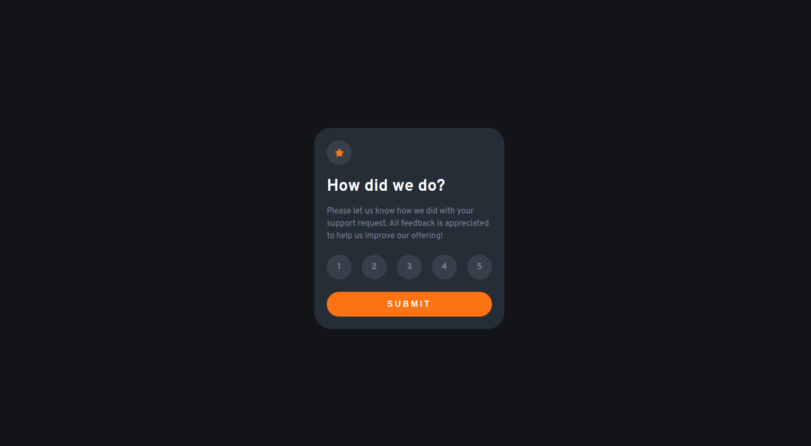

# Frontend Mentor - Interactive rating component solution

This is a solution to the [Interactive rating component challenge on Frontend Mentor](https://www.frontendmentor.io/challenges/interactive-rating-component-koxpeBUmI). Frontend Mentor challenges help you improve your coding skills by building realistic projects.

## Table of contents

-   [Overview](#overview)
    -   [The challenge](#the-challenge)
    -   [Screenshot](#screenshot)
    -   [Links](#links)
-   [My process](#my-process)
    -   [Built with](#built-with)
    -   [What I learned](#what-i-learned)
-   [Author](#author)

## Overview

### The challenge

Users should be able to:

-   View the optimal layout for the app depending on their device's screen size
-   See hover states for all interactive elements on the page
-   Select and submit a number rating
-   See the "Thank you" card state after submitting a rating

### Screenshot



### Links

-   Solution URL: [click here](https://your-solution-url.com)
-   Live Site URL: [click here](https://your-live-site-url.com)

## My process

### Built with

-   Semantic HTML5 markup
-   CSS custom properties
-   Flexbox

### What I learned

Vertically center a div.

```css
.outer {
    display: flex;
    justify-content: center;
    align-items: center;
    height: 100%;
}
```

## Author

-   Linkedin - [Rajesh Yemineni](https://www.linkedin.com/in/rajesh-yemineni/)
-   Frontend Mentor - [@rajeshy45](https://www.frontendmentor.io/profile/rajeshy45)

